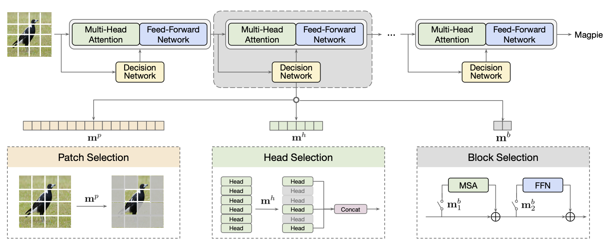

# AdaViT: Adaptive Vision Transformers for Efficient Image Recognition

Lingchen Meng<sup>1</sup>, Hengduo Li<sup>2</sup>, Bor-Chun Chen<sup>3</sup>, Shiyi Lan<sup>2</sup>, Zuxuan Wu<sup>1</sup>, Yu-Gang Jiang<sup>1</sup>, Ser-Nam Lim<sup>3</sup><br><sup>1</sup>Shanghai Key Lab of Intelligent Information Processing, School of Computer Science, Fudan Univeristy, <sup>2</sup>University of Maryland, <sup>3</sup>Meta AI


This repository is an official implementation of the [AdaViT](https://arxiv.org/abs/2111.15668). Code will be avaliable soon.

## Abstract
Built on top of self-attention mechanisms, vision transformers have demonstrated remarkable performance on a variety of tasks recently. While achieving excellent performance, they still require relatively intensive computational cost that scales up drastically as the numbers of patches, self-attention heads and transformer blocks increase. In this paper, we argue that due to the large variations among images, their
need for modeling long-range dependencies between patches differ. To this end, we introduce AdaViT, an adaptive computation framework that learns to derive usage policies on which patches, self-attention heads and transformer blocks to use throughout the backbone on a per-input basis, aiming to improve inference efficiency of vision transformers with a minimal drop of accuracy for image recognition. Optimized jointly with a transformer backbone in an end-to-end manner, a light-weight decision network is attached to the backbone to produce decisions on-the-fly. Extensive experiments on ImageNet demonstrate that our method obtains more than $2\times$ improvement on efficiency compared to state-of-the-art vision transformers with only $0.8\%$ drop of accuracy, achieving good efficiency/accuracy trade-offs conditioned on different computational budgets. We further conduct quantitative and qualitative analysis on learned usage polices and provide more insights on the redundancy in vision transformers.



## Citation
```
@article{meng2021adavit,
  title={AdaViT: Adaptive Vision Transformers for Efficient Image Recognition},
  author={Meng, Lingchen and Li, Hengduo and Chen, Bor-Chun and Lan, Shiyi and Wu, Zuxuan and Jiang, Yu-Gang and Lim, Ser-Nam},
  journal={arXiv preprint arXiv:2111.15668},
  year={2021}
}
```
